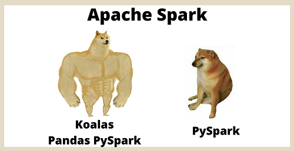

### _Pandas vs Apache Spark? La soluzione è **Koalas**!_

<br>


**_Pandas_**, come già accennato, è una _libreria_ scritta per il linguaggio di programmazione _Python_ che ci permette di manipolare i dati e anche analizzarli in maniera approfondita, semplificando, spesse volte, le operazioni di scrittura del codice che altrimenti sarebbero meno compatte.
Pandas infatti è considerata _una delle quattro librerie principali dell’ecosistema per il datascience di Python insieme a **NumPy**, **SciKit Learn** e **MatPlotLib**_.


**_Apache Spark_**, o più semplicemente Spark, è un _framework open source_ basato sul paradigma _MapReduce_ e consente ottime prestazioni quando si tratta di caricare dati in larga scala e interrogarli ripetutamente, questo grazie al fatto che è stato studiato e realizzato per un uso orientato al _machine learning_.
L’API per _Python_ di Spark è **_PySpark_**.


**_Le principali differenze tra Pandas e Spark_**
Vediamo ora le prime differenze tra _Pandas_ e _Spark_:
- _Pandas_ è rivolto all’elaborazione di collezioni dati di dimensioni relativamente piccole ed è lo standard d’uso su singole macchine;
- _Spark_ è rivolto all’elaborazione di collezioni dati di grandi dimensioni ed è lo standard d’uso per l’elaborazione su archiviazione distribuita.

Ma c’è da dire che, come detto all'inizio, _Pandas_ consente una evidente compattezza del codice e consente anche un’elaborazione più “snella e svelta” dei dati, infatti, ad esempio, un DataFrame in _Pandas_, è mutabile, mentre in _PySpark_ no e per modificarlo bisognerebbe crearne uno nuovo partendo dal vecchio.

Aiutiamoci nella comprensione delle differenze tra l'utilizzo di _Pandas_ e _PySpark_ con le seguenti porzioni di codice:

**_Pandas_**
```import pandas as pd```
```df = pd.read_csv(“my_data.csv)```
```df.columns = ['x', 'y', 'z1']```
```df['x2'] ? df.x * df.x```


**_PySpark_**
`````df = (spark.read.option(“inferSchema”, “true”).`````
`````option(“comment”, True).`````
`````csv(“my_data.csv”))`````
```df = df.toDF(‘x’, ‘y’, ‘z1’)```
```df = df.withColumn(‘x2’, df.x*df.x)```


Com'è possibile notare dal codice qui sopra, l'utilizzo di _Pandas_ è molto più intuitivo e veloce a differenza dell'uso di _PySpark_.

Ed è proprio qui che **_Koalas_** prova a “sistemare le cose”: _Koalas_ infatti è un toolkit, annunciato nell’Aprile del 2019, che effettua una sorta di ""porting" di _Pandas_ sulla piattaforma _Spark_, permettendo quindi l’elaborazione di collezioni di dati molto grandi e con un’archiviazione distribuita in modo smart e compatto.
La svolta apportata da _Koalas_ è quella di poter offrire il medesimo codebase sia per l’utilizzo su _Pandas_ che per l’utilizzo su _PySpark_ senza dover effettuare appunto modifiche al codice (**Nota**: vanno opportunamente modificate le import).

Anche stavolta sfruttiamo due porzioni di codice per capire meglio quanto appena detto:

**_Pandas_**
```import pandas as pd```
```df = pd.read_csv(“my_data.csv)```
```df.columns = ['x', 'y', 'z1']```
```df['x2'] ? df.x * df.x```

**_Koalas_**
```import databricks.koalas as ks```
```df = ks.read_csv(“my_data.csv)```
```df.columns = ['x', 'y', 'z1']```
```df['x2'] ? df.x * df.x```

Come si può notare, a meno degli import per ovvi motivi differenti, dato che stiamo usando due librerie diverse, il codice è esattamente il medesimo.


# _Conclusioni_
Come visto durante questo breve versus, l'utilizzo della piattaforma _Apache Spark_ offre numerosi vantaggi rispetto all'uso della libreria _Pandas_ ma certo tra essi non vi è la semplicità di scrittura del codice.
A porre rimedio a tutto questo ci pensa _Koalas_ che permette lo switch tra _Pandas_ e _Apache Spark_, bypassando _PySpark_ , e sfruttando il medesimo codice.

Stavolta, ironicamente, potremmo usare per capire meglio, al posto di porzioni di codice, un meme per concludere al meglio il nostro discorso:

